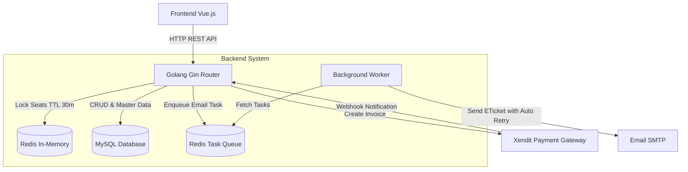
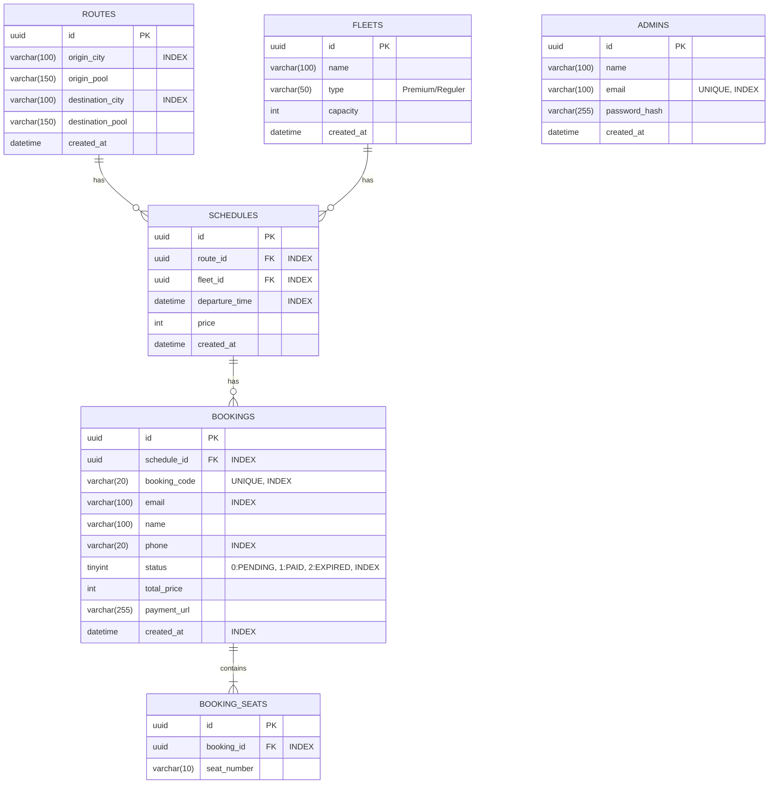
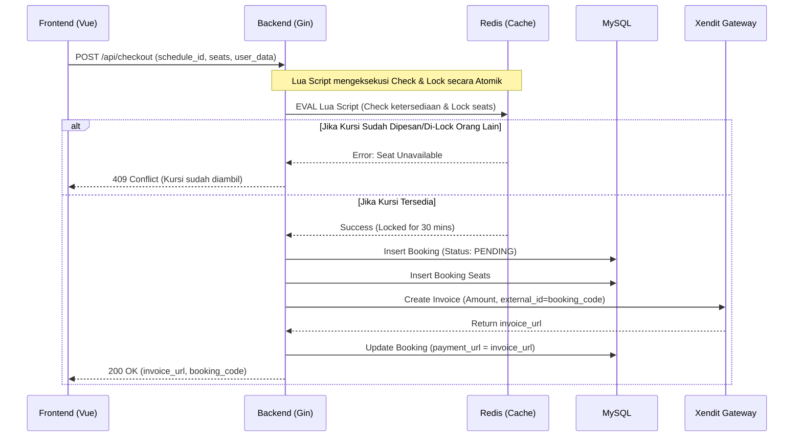

# Backend Architecture & Implementation Plan

Dokumen ini menjelaskan rancangan arsitektur, database, dan alur API untuk backend **MesenShuttle** yang dibangun dengan **Golang**.

## 1. Arsitektur Sistem (System Architecture)

Sistem menggunakan **Golang (Gin Router)** sebagai backend API utama. Data operasional disimpan di **MySQL**, sedangkan **Redis** digunakan khusus untuk menangani *concurrency* (mencegah *double-booking*) melalui mekanisme *locking* yang cepat.

## 2. Skema Database (ER Diagram)

Database MySQL digunakan untuk menyimpan data persisten seperti Rute, Armada, Jadwal, dan Transaksi.

## 3. Alur Concurrency & Checkout (Sequence Diagram)

Ini adalah alur paling kritis pada backend untuk memastikan tidak ada 2 orang yang mem-booking kursi yang sama di waktu bersamaan (Race Condition).

**Catatan Keputusan (Auto-Expire Strategy):**
> 1. **User Facing:** Pelanggan diinformasikan bahwa batas waktu pembayaran adalah **30 menit**.
> 2. **Xendit (Gateway):** Invoice Xendit diset agar kedaluwarsa tepat dalam **30 menit** setelah dibuat.
> 3. **DB Internal (Asynq Delayed Task):** Backend mengirimkan tugas tertunda (Delayed Task) ke Redis Asynq untuk mengecek dan mengubah status pesanan menjadi `EXPIRED` di menit ke-**35**. Penambahan jeda 5 menit ini adalah *buffer* waktu agar jika Xendit telat mengirim webhook "PAID", pesanan tidak telanjur dibatalkan oleh DB kita.
## 4. Spesifikasi API Utama

### 4.1. Admin APIs (Master Data & Auth)
- **`POST /api/admin/login`** : Autentikasi email & password, mengembalikan JWT.
- **`GET /api/admin/routes`** : Mendapatkan daftar pool asal dan tujuan (Protected by JWT).
- **`POST /api/admin/routes`** : Menambahkan rute baru (Protected by JWT).
- **`GET /api/admin/fleets`** : Mendapatkan daftar armada (Protected by JWT).
- **`POST /api/admin/fleets`** : Menambahkan armada baru (Protected by JWT).
- **`GET /api/admin/schedules`** : Mendapatkan jadwal keberangkatan (Protected by JWT).
- **`POST /api/admin/schedules`** : Menambahkan jadwal baru (Protected by JWT).

### 4.2. Customer APIs (Pemesanan)
- **`GET /api/schedules`**
  - *Query Params*: `origin`, `destination`, `date`.
  - *Response*: Daftar jadwal yang cocok beserta sisa kursi.
- **`GET /api/schedules/:id/seats`**
  - *Response*: Daftar kursi dengan status `Available`, `Locked` (dari Redis), atau `Booked` (dari DB).
- **`POST /api/checkout`**
  - *Payload*: `{ schedule_id, seats: ["1", "2"], name, email, phone }`
  - *Response*: `{ booking_code, payment_url }`
- **`POST /api/webhooks/payments`**
  - *Payload*: Notifikasi status pembayaran dari Payment Gateway (misal Xendit) (`PAID` / `EXPIRED`).
  - *Action*: Update status di DB, kirim email tiket jika `PAID`, rilis lock Redis.

## 5. Tahapan Eksekusi Backend (User Stories)

**Phase 1: Inisialisasi & Setup Lingkungan**
- `[ ]` As a BE, I want to setup project Golang (`mesenshuttle-backend`).
- `[ ]` As a BE, I want to setup Database MySQL and GORM Auto-migration.
- `[ ]` As a BE, I want to setup Redis connection.

**Phase 2: Pengembangan API Admin (Master Data & Auth)**
- `[ ]` As a FE, I want to have endpoint to login and receive JWT token.
- `[ ]` As a FE, I want to have endpoint to get list of Routes (`GET /api/admin/routes`).
- `[ ]` As a FE, I want to have endpoint to create a new Route (`POST /api/admin/routes`).
- `[ ]` As a FE, I want to have endpoint to update a Route (`PUT /api/admin/routes/:id`).
- `[ ]` As a FE, I want to have endpoint to delete a Route (`DELETE /api/admin/routes/:id`).
- `[ ]` As a FE, I want to have endpoint to get list of Fleets (`GET /api/admin/fleets`).
- `[ ]` As a FE, I want to have endpoint to create a new Fleet (`POST /api/admin/fleets`).
- `[ ]` As a FE, I want to have endpoint to update a Fleet (`PUT /api/admin/fleets/:id`).
- `[ ]` As a FE, I want to have endpoint to delete a Fleet (`DELETE /api/admin/fleets/:id`).
- `[ ]` As a FE, I want to have endpoint to get list of Schedules (`GET /api/admin/schedules`).
- `[ ]` As a FE, I want to have endpoint to create a new Schedule (`POST /api/admin/schedules`).
- `[ ]` As a FE, I want to have endpoint to update a Schedule (`PUT /api/admin/schedules/:id`).
- `[ ]` As a FE, I want to have endpoint to delete a Schedule (`DELETE /api/admin/schedules/:id`).

**Phase 3: API Pencarian & Peta Kursi (Seat Map)**
- `[ ]` As a FE, I want to have endpoint to search schedules based on origin, destination, and date.
- `[ ]` As a FE, I want to have endpoint to view seat map that combines booked status (DB) and locked status (Redis).

**Phase 4: Algoritma Concurrency (Checkout)**
- `[ ]` As a FE, I want to have endpoint to checkout and lock selected seats.
- `[ ]` As a BE, I want to execute Redis Lua Script during checkout to prevent double-booking atomically.

**Phase 5: Gateway Pembayaran & Notifikasi**
- `[ ]` As a BE, I want to integrate Xendit to generate invoice URL during checkout.
- `[ ]` As a BE, I want to have a generic endpoint to receive payment webhooks (`/api/webhooks/payments`).
- `[ ]` As a BE, I want to enqueue E-Ticket sending task to Redis Task Queue (Asynq) for reliable background email processing.
