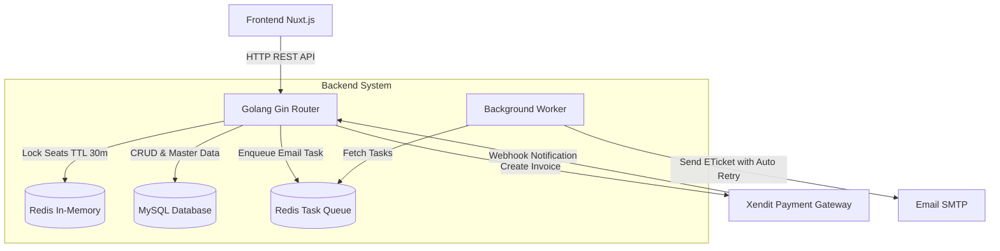
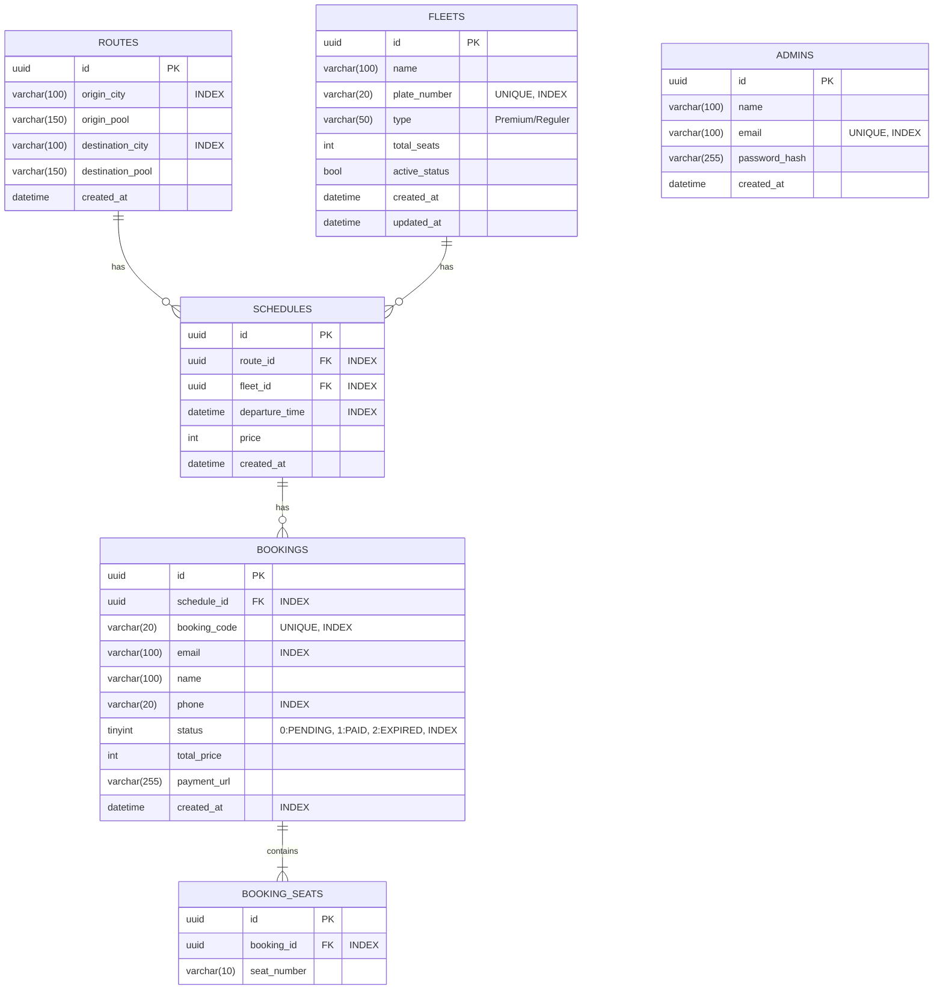
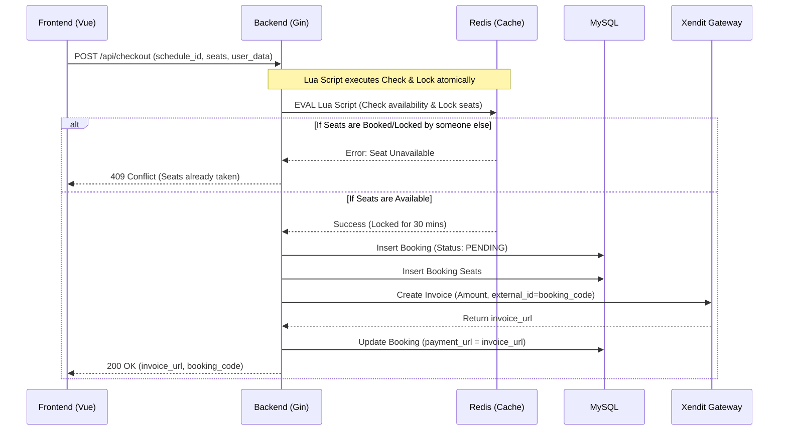

# Backend Architecture & Implementation Plan

This document explains the architecture design, database schema, and API flow for the **MesenShuttle** backend built with **Golang**.

## 1. System Architecture

The system uses **Golang (Gin Router)** as the main backend API. Operational data is stored in **MySQL**, while **Redis** is used specifically to handle concurrency (preventing double-booking) through a fast locking mechanism.

## 2. Database Schema (ER Diagram)

The MySQL database is used to store persistent data such as Routes, Fleets, Schedules, and Bookings.

## 3. Concurrency & Checkout Flow (Sequence Diagram)

This is the most critical flow in the backend to ensure that no two people book the same seat at the same time (Race Condition).

**Decision Notes (Auto-Expire Strategy):**
> 1. **User Facing:** Customers are informed that the payment time limit is **30 minutes**.
> 2. **Xendit (Gateway):** The Xendit invoice is set to expire exactly **30 minutes** after creation.
> 3. **Internal DB (Asynq Delayed Task):** The backend sends a delayed task to the Redis Asynq queue to check and update the booking status to `EXPIRED` at the **35th** minute. The additional 5-minute buffer ensures that if Xendit is late in sending the "PAID" webhook, the booking is not prematurely canceled by our DB.

## 4. Core API Specifications

### 4.1. Admin APIs (Master Data & Auth)
- **`POST /api/admin/login`** : Authenticate email & password, return JWT.
- **`GET /api/admin/routes`** : Get list of origin and destination pools (Protected by JWT).
- **`POST /api/admin/routes`** : Add a new route (Protected by JWT).
- **`PUT /api/admin/routes/:id`** : Update a route (Protected by JWT).
- **`DELETE /api/admin/routes/:id`** : Delete a route (Protected by JWT).
- **`GET /api/admin/fleets`** : Get list of fleets (Protected by JWT).
- **`POST /api/admin/fleets`** : Add a new fleet (Protected by JWT).
- **`PUT /api/admin/fleets/:id`** : Update a fleet (Protected by JWT).
- **`DELETE /api/admin/fleets/:id`** : Delete a fleet (Protected by JWT).
- **`GET /api/admin/schedules`** : Get departure schedules (Protected by JWT).
- **`POST /api/admin/schedules`** : Add a new schedule (Protected by JWT).

### 4.2. Customer APIs (Booking)
- **`GET /api/schedules`**
  - *Query Params*: `origin`, `destination`, `date`.
  - *Response*: List of matching schedules along with remaining seats.
- **`GET /api/schedules/:id/seats`**
  - *Response*: List of seats with status `Available`, `Locked` (from Redis), or `Booked` (from DB).
- **`POST /api/checkout`**
  - *Payload*: `{ schedule_id, seats: ["1", "2"], name, email, phone }`
  - *Response*: `{ booking_code, payment_url }`
- **`POST /api/webhooks/payments`**
  - *Payload*: Payment status notification from Payment Gateway (e.g., Xendit) (`PAID` / `EXPIRED`).
  - *Action*: Update status in DB, send e-ticket email if `PAID`, release Redis lock.

## 5. Backend Execution Phases (User Stories)

**Phase 1: Initialization & Environment Setup**
- `[x]` As a BE, I want to setup project Golang (`mesenshuttle-backend`).
- `[x]` As a BE, I want to setup Database MySQL and GORM Auto-migration.
- `[x]` As a BE, I want to replace AutoMigrate with Goose versioned migrations.
- `[x]` As a BE, I want to setup Redis connection.

**Phase 2: Admin API Development (Master Data & Auth)**
- `[x]` As a FE, I want to have endpoint to login and receive JWT token.
- `[x]` As a FE, I want to have endpoint to get list of Routes (`GET /api/admin/routes`).
- `[x]` As a FE, I want to have endpoint to create a new Route (`POST /api/admin/routes`).
- `[x]` As a FE, I want to have endpoint to update a Route (`PUT /api/admin/routes/:id`).
- `[x]` As a FE, I want to have endpoint to delete a Route (`DELETE /api/admin/routes/:id`).
- `[x]` As a FE, I want to have endpoint to get list of Fleets (`GET /api/admin/fleets`).
- `[x]` As a FE, I want to have endpoint to create a new Fleet (`POST /api/admin/fleets`).
- `[x]` As a FE, I want to have endpoint to update a Fleet (`PUT /api/admin/fleets/:id`).
- `[x]` As a FE, I want to have endpoint to delete a Fleet (`DELETE /api/admin/fleets/:id`).
- `[x]` As a FE, I want to have endpoint to get list of Schedules (`GET /api/admin/schedules`).
- `[ ]` As a FE, I want to have endpoint to create a new Schedule (`POST /api/admin/schedules`).
- `[ ]` As a FE, I want to have endpoint to update a Schedule (`PUT /api/admin/schedules/:id`).
- `[ ]` As a FE, I want to have endpoint to delete a Schedule (`DELETE /api/admin/schedules/:id`).

**Phase 3: Search & Seat Map API**
- `[ ]` As a FE, I want to have endpoint to search schedules based on origin, destination, and date.
- `[ ]` As a FE, I want to have endpoint to view seat map that combines booked status (DB) and locked status (Redis).

**Phase 4: Concurrency Algorithm (Checkout)**
- `[ ]` As a FE, I want to have endpoint to checkout and lock selected seats.
- `[ ]` As a BE, I want to execute Redis Lua Script during checkout to prevent double-booking atomically.

**Phase 5: Payment Gateway & Notifications**
- `[ ]` As a BE, I want to integrate Xendit to generate invoice URL during checkout.
- `[ ]` As a BE, I want to have a generic endpoint to receive payment webhooks (`/api/webhooks/payments`).
- `[ ]` As a BE, I want to enqueue E-Ticket sending task to Redis Task Queue (Asynq) for reliable background email processing.
