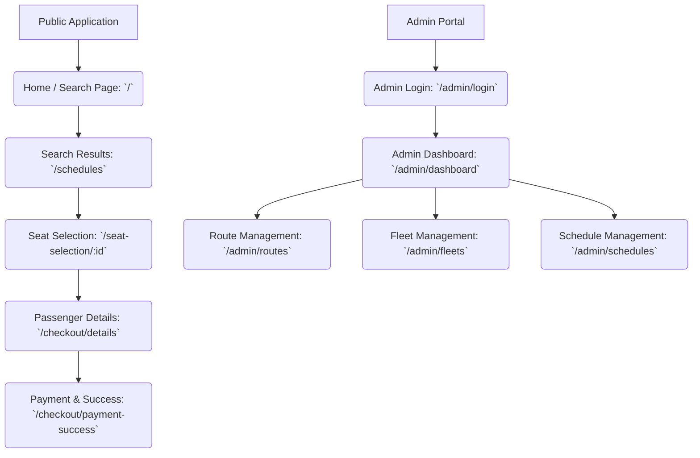

# Frontend UI Implementation Plan

We will focus on building the User Interface using **Nuxt.js and Nuxt UI** with mock data, without any backend integration initially. Below is the breakdown of the required pages, their core components, the sitemap, and the execution task list.

## 1. Page Map (Sitemap)

## 2. Customer Flow (Public Pages)

These pages will allow a guest user to browse schedules, select seats, and complete a mock booking.

### 2.1 Home / Search Page (`/`)
- **Purpose**: The landing page where users initiate their booking.
- **Components**:
  - Hero section with a welcoming premium design.
  - Search Form: Origin Pool Dropdown, Destination Pool Dropdown, Departure Date Picker, "Search Buses" Button.

### 2.2 Search Results Page (`/schedules`)
- **Purpose**: Displays available bus schedules based on search criteria.
- **Components**:
  - Search summary (Origin, Destination, Date).
  - List of available schedules (Cards/List view): Departure/Arrival Time, Bus Type (Premium or Standard), Price, "Select Seat" Button.

### 2.3 Seat Selection Page (`/seat-selection/:scheduleId`)
- **Purpose**: Interactive seat map for the user to choose their seat.
- **Components**:
  - Bus Information (Route, Time, Type).
  - Interactive Seat Map:
    - **Standard Bus**: 1-2 configuration (e.g., [Seat] - Aisle - [Seat][Seat]).
    - **Premium Bus**: 1-1 configuration (e.g., [Seat] - Aisle - [Seat]).
    - Legend: Available, Selected, Unavailable (mock locked seats).
  - "Continue to Passenger Details" Button.

### 2.4 Passenger Details Page (`/checkout/details`)
- **Purpose**: Collect user information for the guest checkout.
- **Components**:
  - Booking Summary (Route, Time, Selected Seat, Total Price).
  - Form: Email Address (Primary Identifier), Full Name, Phone Number.
  - "Proceed to Payment" Button.

### 2.5 Mock Payment & Confirmation Page (`/checkout/payment-success`)
- **Purpose**: Simulates the Xendit payment flow and displays the final ticket.
- **Components**:
  - "Pay Now" Mock Button (Simulating Xendit redirection).
  - Success state showing E-Ticket details (Booking ID, Passenger Details, QR Code placeholder).

---

## 3. Admin Flow (Protected Pages)

These pages are for the operational staff to manage the system.

### 3.1 Admin Login Page (`/admin/login`)
- **Purpose**: Authentication for admin access.
- **Components**: Email and Password form.

### 3.2 Admin Dashboard (`/admin/dashboard`)
- **Purpose**: Overview of system statistics.
- **Components**: Sidebar navigation, mock metrics (total bookings today, active buses, etc.).

### 3.3 Route (Pool) Management (`/admin/routes`)
- **Purpose**: Manage origin and destination pools.
- **Components**: Data table of existing routes, "Add New Route" Modal/Form.

### 3.4 Fleet Management (`/admin/fleets`)
- **Purpose**: Manage buses and their types.
- **Components**: Data table of fleets (Bus Name, Type: Premium/Standard, Capacity), "Add New Bus" Modal/Form.

### 3.5 Schedule Management (`/admin/schedules`)
- **Purpose**: Assign fleets to routes at specific times.
- **Components**: Data table of schedules, Form to link a Route, a Fleet, Departure Time, and set the Price.

---

## 4. Frontend UI Task Breakdown

- `[ ]` **Phase 1: Project Initialization**
  - `[ ]` Initialize a new Nuxt.js project.
  - `[ ]` Install and configure Nuxt UI and Tailwind CSS.
  - `[ ]` Setup global state management (e.g., Pinia) for mock data.

- `[ ]` **Phase 2: Core Architecture & Mock Data**
  - `[ ]` Create mock data sets (Routes, Fleets, Schedules).
  - `[ ]` Setup basic layouts (`default.vue` for customers, `admin.vue` for admin).
  - `[ ]` Create global components (Navbar, Footer).

- `[ ]` **Phase 3: Customer Flow (Public)**
  - `[ ]` Build Home/Search Page (`/`) with Hero and Search Form.
  - `[ ]` Build Search Results Page (`/schedules`) displaying available buses.
  - `[ ]` Build Seat Selection Page (`/seat-selection/:id`) with interactive Standard (1-2) and Premium (1-1) layouts.
  - `[ ]` Build Passenger Details Page (`/checkout/details`) to collect email and name.
  - `[ ]` Build Mock Payment & Success Page (`/checkout/payment-success`) displaying the E-Ticket.

- `[ ]` **Phase 4: Admin Flow (Protected)**
  - `[ ]` Build Admin Login Page (`/admin/login`).
  - `[ ]` Build Admin Dashboard (`/admin/dashboard`) with mock metrics.
  - `[ ]` Build Route Management Page (`/admin/routes`) with data tables.
  - `[ ]` Build Fleet Management Page (`/admin/fleets`).
  - `[ ]` Build Schedule Management Page (`/admin/schedules`).

- `[ ]` **Phase 5: Review & Polish**
  - `[ ]` Ensure premium aesthetics (clean and modern design, smooth animations).
  - `[ ]` Verify responsive design across all pages.
