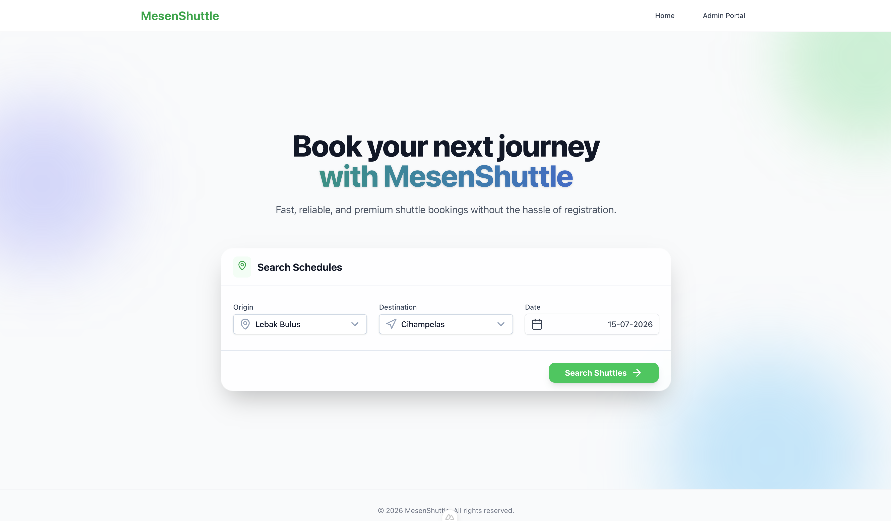
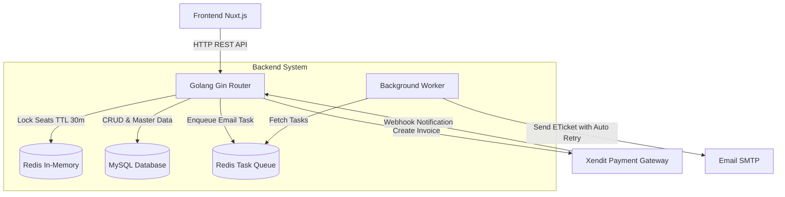
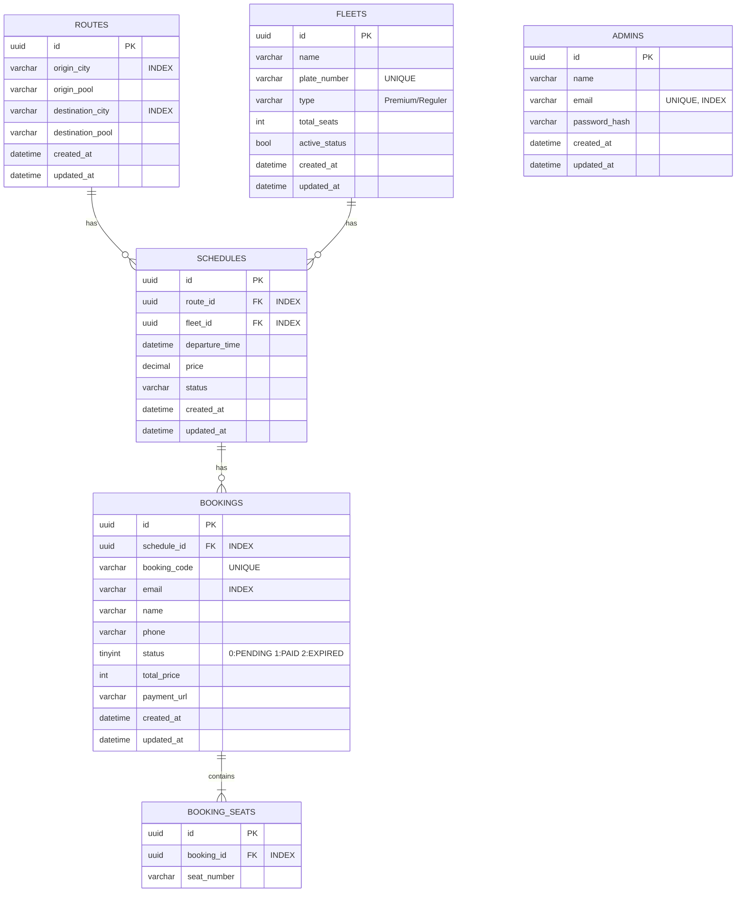
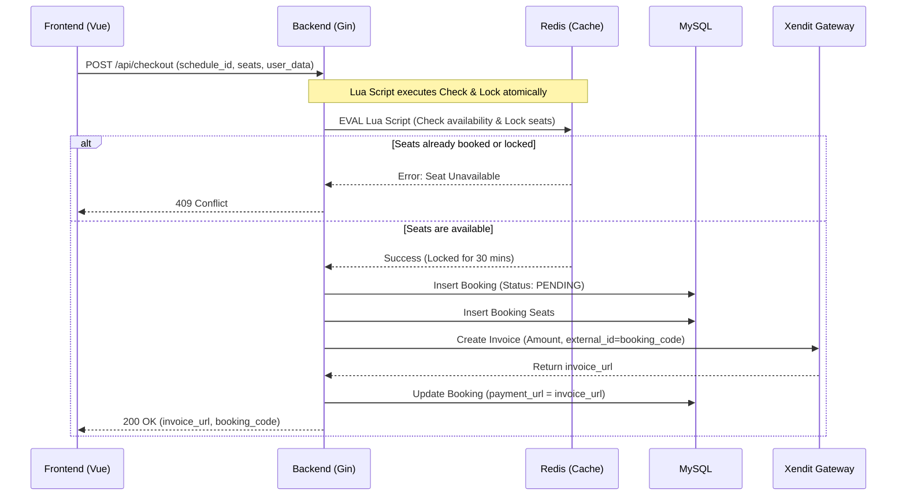

# MesenShuttle 🚌

> A full-stack shuttle bus booking platform built to solve the real-world problem of concurrent seat reservations — without requiring user registration.



---

## The Problem

When multiple passengers attempt to book the last available seat simultaneously, a naive implementation allows both requests to pass the availability check before either write completes — resulting in double-booking.

MesenShuttle solves this using **Redis Lua Scripts** for atomic seat locking: the check-and-lock operation executes as a single indivisible unit, making it physically impossible for two users to acquire the same seat.

---

## Project Status

| Feature | Status |
|---|---|
| Admin Authentication (JWT) | ✅ Done |
| Route Management (GET, POST, PUT, DELETE) | ✅ Done |
| Fleet Management (GET, POST, PUT) | ✅ Done |
| Schedule Management | 📋 Planned |
| Seat Map + Redis Atomic Locking | 📋 Planned |
| Xendit Payment Integration | 📋 Planned |
| Asynq Background Email Queue | 📋 Planned |

---

## Tech Stack

| Layer | Technology |
|---|---|
| **Frontend** | Nuxt.js 3 (Vue 3) |
| **Backend** | Golang — Gin Framework + GORM |
| **Database** | MySQL 8 |
| **Cache & Seat Locking** | Redis (Lua Scripts) |
| **Task Queue** | Asynq (Redis-backed) |
| **Payment Gateway** | Xendit |
| **API Spec** | OpenAPI 3.0 |
| **Infrastructure** | Docker & Docker Compose |

---

## System Architecture



---

## Database Design



---

## Checkout Flow — Concurrency Design

The most critical design in the system. The sequence below shows how a race condition between two simultaneous requests is handled atomically using a Redis Lua Script.



**Expiry Strategy:**
- **User-facing**: 30-minute payment window communicated to the customer.
- **Xendit**: Invoice TTL set to exactly 30 minutes.
- **Asynq Delayed Task**: A background job is enqueued to expire the booking at the **35th minute** — a 5-minute buffer to ensure a late-arriving Xendit webhook isn't beaten by our own cleanup job.

---

## Key Technical Decisions

- **Redis Lua Script over distributed locks**: Lua scripts execute atomically inside Redis, avoiding the overhead of SETNX-based distributed locks while guaranteeing exactly-once seat acquisition.
- **Guest checkout (email as identifier)**: Removing registration friction was a deliberate product decision to maximize booking conversion. Email is used as the unique customer identifier.
- **Manual DI over Wire/Dig**: Kept dependency injection explicit and readable for a solo project. Container modules (`internal/container`) group related wiring per feature domain.
- **Asynq over RabbitMQ/Kafka**: Simpler operational profile — Asynq reuses the existing Redis instance and provides reliable retry semantics without a separate message broker.
- **`cmd/cli` for migrations**: AutoMigrate removed from the API boot path; a separate CLI binary (`go run ./cmd/cli -migrate`) runs migrations explicitly to prevent unsafe schema changes during rolling deployments.

---

## Backend Directory Structure

```
backend/
├── cmd/
│   ├── api/          # HTTP server entrypoint
│   └── cli/          # Migration & seeder CLI (-migrate, -seed)
├── internal/
│   ├── container/    # DI modules (AuthModule, RouteModule)
│   ├── controllers/  # HTTP handlers
│   ├── services/     # Business logic
│   ├── repositories/ # Data access layer
│   ├── dto/          # Request/Response DTOs (snake_case)
│   ├── middlewares/  # JWT auth, rate limiter, structured logger
│   └── models/       # GORM database models
└── pkg/
    ├── apperrors/    # Typed AppError factories (NewNotFound, NewDuplicateField, NewUnauthorized)
    ├── database/     # MySQL & Redis initializers
    └── utils/        # JWT, bcrypt, response helpers (HandleError, FormatValidationErrors)
```

---

## Prerequisites

- [Docker](https://www.docker.com/products/docker-desktop) and Docker Compose
- [Node.js](https://nodejs.org/) v20+ (for local frontend development)
- [Golang](https://go.dev/) v1.22+ (for local backend development)

---

## 🛠 Running the Project (Development Mode)

Hot-reload enabled via `air` (backend) and Vite HMR (frontend).

```bash
cp backend/.env.example backend/.env
cp frontend/.env.example frontend/.env
cp docker-compose.override.yml.example docker-compose.override.yml

docker compose up -d --build
```

| Service | URL |
|---|---|
| Frontend | http://localhost:3000 |
| Backend API | http://localhost:8081 |
| MySQL | localhost:3306 |
| Redis | localhost:6380 |

**Running Locally Without Docker:**
```bash
# Backend
cd backend
go run ./cmd/cli -migrate         # Run database migrations
go run ./cmd/cli -seed            # Seed initial admin user

You can also use these migration commands:
go run ./cmd/cli -migrate-status  # Check migration status
go run ./cmd/cli -rollback        # Rollback the last migration

go run ./cmd/api            # start the API server

# Frontend
cd frontend
npm install
npm run dev
```

---

## 🚀 Running the Project (Production Mode)

```bash
docker compose -f docker-compose.yml up -d --build
```

---

## 🗄️ Database Migrations (Goose)

This project uses `pressly/goose` for safe, versioned database migrations. All migration files are located in `backend/db/migrations/`.

**1. Create a new migration file:**
If you need to alter the database schema, install goose CLI (`go install github.com/pressly/goose/v3/cmd/goose@latest`) and run:
```bash
goose -dir backend/db/migrations create add_capacity_to_fleets sql
```
*This will generate a new timestamped `.sql` file with `-- +goose Up` and `-- +goose Down` blocks where you can write your raw SQL.*

**2. Apply migrations:**
```bash
cd backend
go run ./cmd/cli -migrate
```

**3. Check migration status:**
```bash
cd backend
go run ./cmd/cli -migrate-status
```

**4. Rollback the last migration:**
```bash
cd backend
go run ./cmd/cli -rollback
```

---

## 📚 API Documentation

Full OpenAPI 3.0 specification is available at [`backend/openapi.yaml`](backend/openapi.yaml).
Import into **Postman**, **Swagger UI**, or **Insomnia**.

---

## 🧪 Testing

Unit tests cover the business logic and HTTP handler layers using `testify` and mock interfaces.

```bash
cd backend
go test -v ./...
```

---

## Known Limitations & Roadmap

- **Migrations**: The project uses `pressly/goose` for robust, versioned SQL migrations located in `backend/db/migrations`.
- **Payment Handling**: The frontend does not process payments directly. All state transitions happen exclusively through the webhook.
- **Rate Limiting**: Currently IP + User-Agent based on the login endpoint. A JWT-scoped approach would be more robust for authenticated routes.
- **Tests**: Only unit tests with mocks exist today. Integration tests against a real test database are planned.
- **Phases 3–5**: Seat map, payment integration, and email queue are planned (see `.plans/backend_plan.md` for full execution roadmap).
